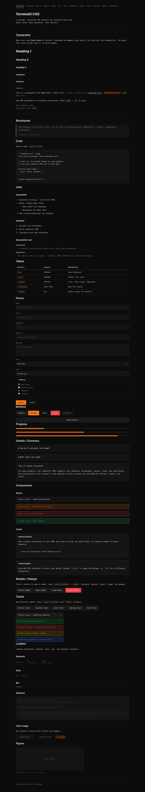

# TerminalX CSS

A minimal, classless CSS library for terminal-style UIs.



**[Live Demo](https://ex3ndr.github.io/terminalx/)**

## Features

- **Geist + Geist Mono** fonts (sans for headings, mono for body)
- **Dark theme** inspired by 80s Kubrick aesthetics's color scheme
- **Classless** — semantic HTML elements styled by default
- **Soft details** — rounded corners, subtle borders, smooth transitions
- **CSS variables** — fully customizable
- **Components** — modals, toasts, loaders, badges, toggles, and more

## Usage

1. Copy `terminalx.css` into your project
2. Link it in your HTML:

```html
<link rel="stylesheet" href="terminalx.css">
```

3. Write semantic HTML — no classes needed for base elements:

```html
<h1>Hello</h1>
<p>This is already styled.</p>
<a href="#">Links work too</a>

<table>
  <thead><tr><th>Name</th><th>Status</th></tr></thead>
  <tbody><tr><td>API</td><td>Online</td></tr></tbody>
</table>

<form>
  <label for="name">Name</label>
  <input type="text" id="name" placeholder="Enter name">
  <button type="submit">Submit</button>
</form>
```

## Customization

Override CSS variables on `:root`:

```css
:root {
  --accent: #8b5cf6;    /* swap orange for purple */
  --bg: #111111;        /* slightly lighter background */
  --radius: 8px;        /* rounder corners */
}
```

## What's Included

**Base elements** (classless): headings, paragraphs, links, lists, tables, forms, buttons, code blocks, blockquotes, details/summary, progress bars, figures, navigation, `hr`.

**Components** (optional classes): `.card`, `.alert`, `.badge`, `.toggle`, `.modal`, `.toast`, `.loader`, `.skeleton`, `.pill-group`, `.item-list`, `.sidebar-layout`, `.sidebar-nav`, `.inline-form`, `.empty-state`, `.danger-zone`.

**Button variants**: `.btn-primary`, `.btn-ghost`, `.btn-error`, `.btn-success`, `.btn-sm`, `.btn-block`.

## Examples

See the `examples/` folder for full demo pages, or browse them at **[ex3ndr.github.io/terminalx](https://ex3ndr.github.io/terminalx/)**.

Examples include: component showcase, pipeline view, build history, agent fleet, task queue, run detail, diff viewer, template registry, cost tracker, audit log, quality gate, model config, webhooks, issue tracker, changelog, docs, dashboard, blog, and settings.

## License

MIT
